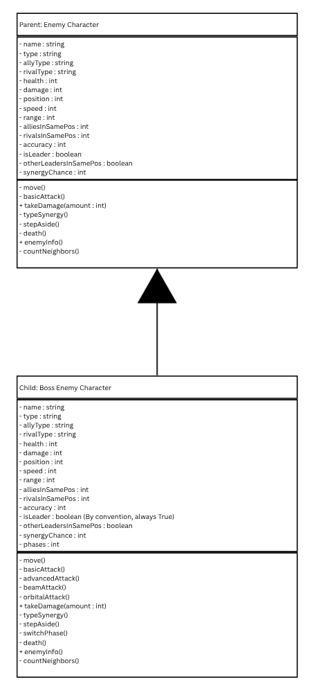
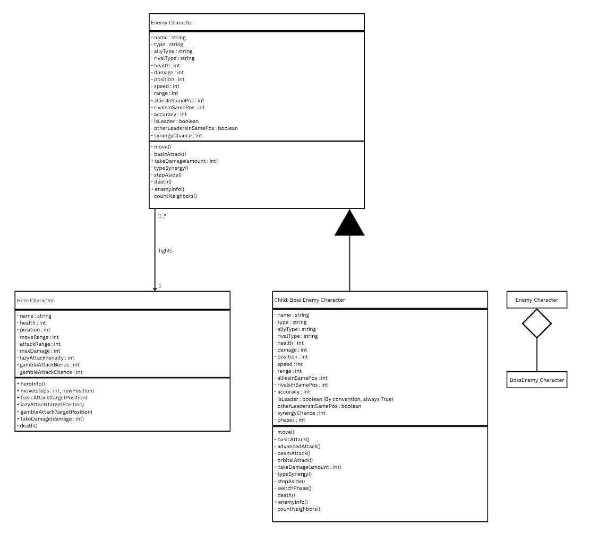
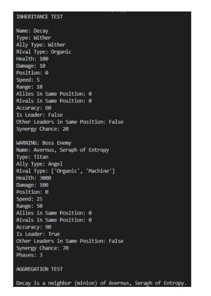
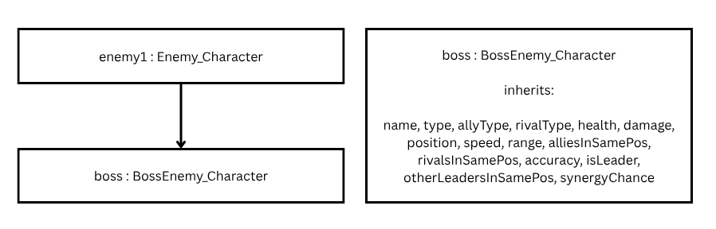

# Advanced Class Relationships

## Previous Activities

[classAttrib](classAttributesMethods.md)

[classRel](classRelationships.md)

## Existing System Description:

## Inheritance Relationship

Parent: Enemy

Child: BossEnemy

Explanation: A BossEnemy child is a type of the parent Enemy because BossEnemy would be a more complex and specialized form of Enemy.

## Inheritance UML

## Composition/Aggregation

Relationship:

Explanation:

## Advanced UML Diagram

## Python Implementation

[Source Code](advancedRelationships.py)

## Test Run

## Object Diagram

## Reflection

Answers: