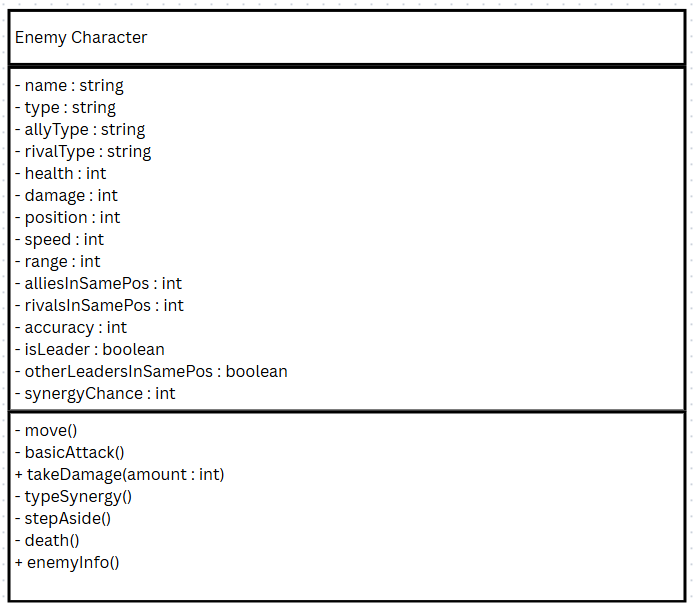

# Class Attributes and Methods

## Previous Design
Link to my previous activity:
[classObjectUML.md](classObjectUML.md)

## Design Revision
Changes from my previous design:

- Organized the properties in the class diagram for cleanliness.
- Revised the methods move, basicAttack, takeDamage, typeSynergy, and stepAside to account for attribute visibility
- Added new methods death() and enemyInfo()

## Visibility Decisions
| Attribute | Data Type | Visibility | Reason |
|---|---|---|---|
| name | string | Private | Unchangable by convention |
| type | string | Private | To not have external code change it. |
| allyType | string | Private | To not have external code change it. |
| rivalType | string | Private | To not have external code change it. |
| health | int | Private | To not have external code change it. |
| damage | int | Private | To have a "fixed" attack stat. |
| position | int | Private | To not have external code change it. |
| speed | int | Private | To have a fixed speed stat. |
| range | int | Private | To have a fixed range stat. |
| alliesInSamePos | int | Private | To not have external code change it. |
| rivalsInSamePos | int | Private | To not have external code change it. |
| accuracy | int | Private | To have a fixed accuracy stat. |
| isLeader | boolean | Private | To make the enemy permanently elegible for a synergy attack. |
| otherLeadersInSamePos | boolean | Private | To not have external code change it. |
| synergyChance | int | Private | To have a fixed trigger chance for a synergy attack. |

## Updated UML Class Diagram

## Python Implementation
[View Python Source](classImplementation.py)

## Test Run

## Object Diagram

## Analysis

### Why did you make your chosen attribute private?
.

### Which method changes the state of your object?
.

### How did your two objects demonstrate that instances are independent?
.

### What is the difference between your class diagram and your object diagram?
.