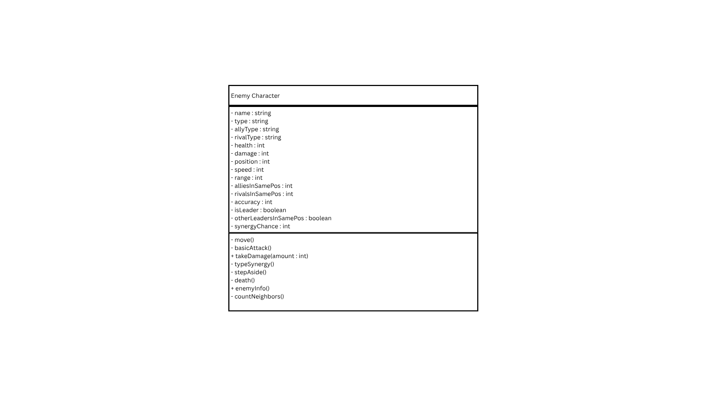
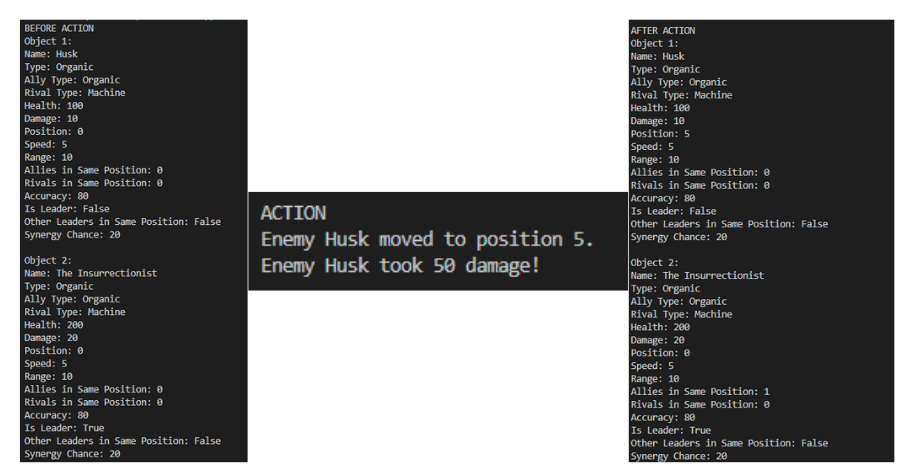
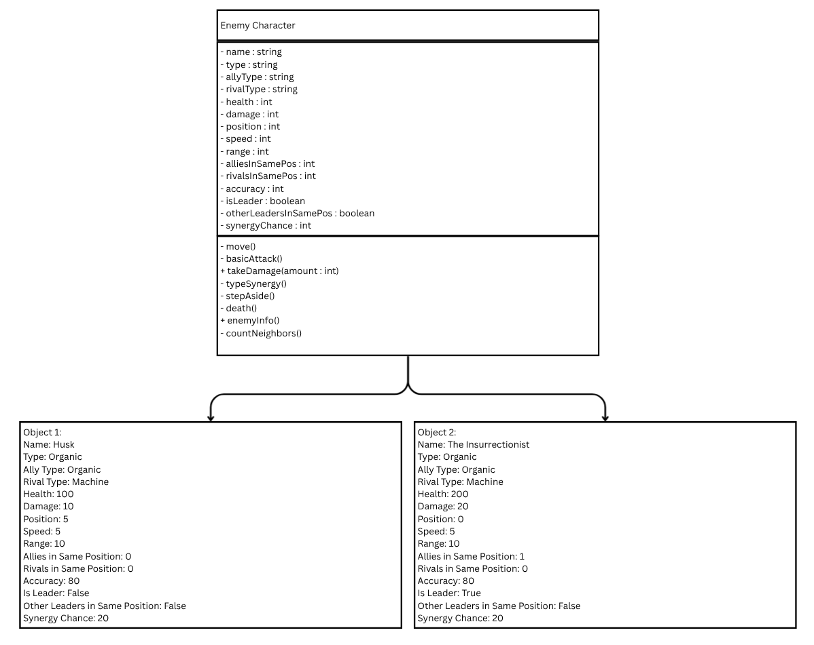

# Class Attributes and Methods

## Previous Design
Link to my previous activity:
[classObjectUML.md](classObjectUML.md)

## Design Revision
Changes from my previous design:

- Organized the properties in the class diagram for cleanliness.
- Revised the methods move, basicAttack, takeDamage, typeSynergy, and stepAside to account for attribute visibility
- Added new methods death() and enemyInfo()

## Visibility Decisions
| Attribute | Data Type | Visibility | Reason |
|---|---|---|---|
| name | string | Private | Unchangable by convention |
| type | string | Private | To not have external code change it. |
| allyType | string | Private | To not have external code change it. |
| rivalType | string | Private | To not have external code change it. |
| health | int | Private | To not have external code change it. |
| damage | int | Private | To have a "fixed" attack stat. |
| position | int | Private | To not have external code change it. |
| speed | int | Private | To have a fixed speed stat. |
| range | int | Private | To have a fixed range stat. |
| alliesInSamePos | int | Private | To not have external code change it. |
| rivalsInSamePos | int | Private | To not have external code change it. |
| accuracy | int | Private | To have a fixed accuracy stat. |
| isLeader | boolean | Private | To make the enemy permanently elegible for a synergy attack. |
| otherLeadersInSamePos | boolean | Private | To not have external code change it. |
| synergyChance | int | Private | To have a fixed trigger chance for a synergy attack. |

## Updated UML Class Diagram

## Python Implementation
[View Python Source](classImplementation.py)

## Test Run

## Object Diagram

## Analysis

### Why did you make your chosen attribute private?
This is because keeping attributes private protects them from being accidentally changed by code outside the class. If other parts of the program outside the class changed it directly, the class may not function as expected.

### Which method changes the state of your object?
The methods used are move() and takeDamage(amount), with move() changing the object's attribute position by increasing it by another of its attributes speed, and takeDamage(amount) decreasing its health attribute by the amount value.

### How did your two objects demonstrate that instances are independent?
Based on the actual test output, instances of a class are independent because the methods they use only affect themselves instead of other instances, such as changing Object 1's position and health while Object 2 remains unchanged.

### What is the difference between your class diagram and your object diagram?
A class diagram shows the blueprint of class' attributes and methods while the object diagram includes the blueprint of the class' attributes and methods, but it also includes objects and their attributes created from the blueprint.