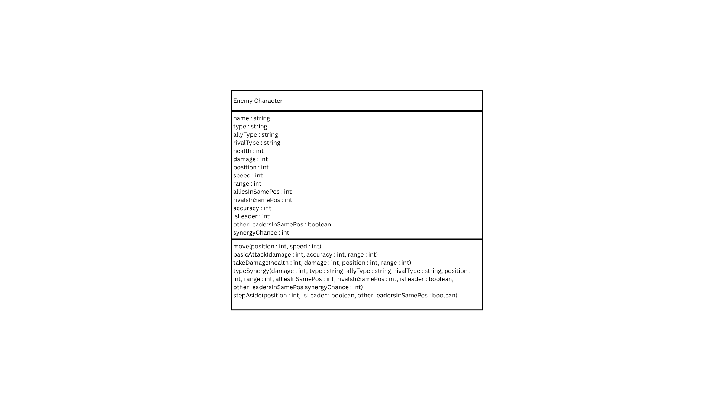

# SG4 - Understanding Classes and Objects

## Class Name: Enemy

## Class Description: Represents an enemy character in a video game.

## Properties

| Property | Data Type | Description |
|---|---|---|
| name | string | The name of the enemy. |
| type | string | The category of the enemy. |
| rank | string | The significance or rank of the enemy. |
| health | int | The enemy's base health. |
| variant | string | A slight variation of the same enemy. |
| weight | string | The weight category of the enemy. |

## Methods

| Method | Description |
|---|---|
| move(x speed: int, destination: float) | Makes the enemy move a certain speed towards a certain position. |
| attack(attack: list[i], x damage: int, type) | An attack from a list of attacks of a certain damage and type. |
| speak(line: string) | Makes the enemy emit a sound or speak one of its lines. |
| interact(target: canInteractWith[i], action: actions[i]) | Interacts with a certain target via a specifc action. |

## Class Diagram

## Design Explanation

### Why did you choose this class?

### Which property is the most important? Why?

### Which method is the most useful? Why?
