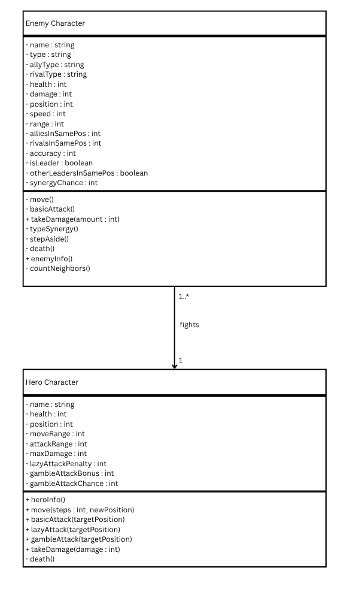
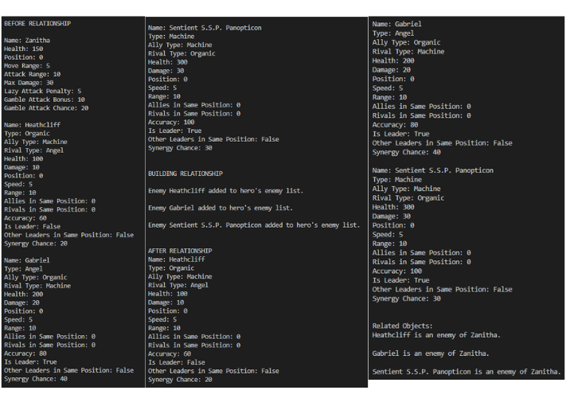
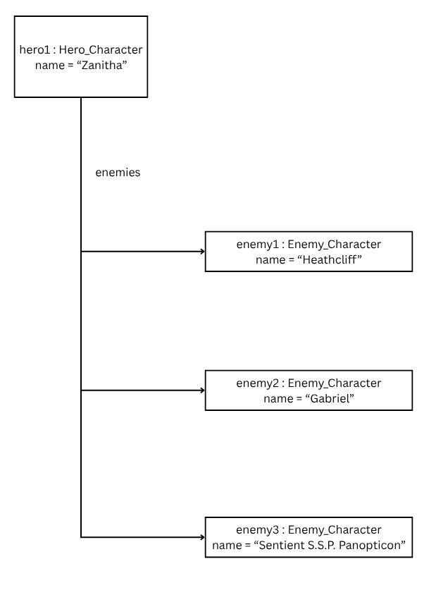

# Class Relationships: Association and Multiplicity

## Previous Work

[Part I - Classes and Objects](classObjectUML.md)

[Part II - Class Attributes and Methods](classAttributesMethods.md)

## Existing Class

Class: Enemy Character

Description: An enemy character to fight in a video game context.

## New Related Class

Class: Hero Character

Description: A hero character that will fight the enemy characters.

## Association

Relationship: Enemy fights Hero.

Explanation: Logically, enemy characters fight the hero character and the hero fights the enemies.

## Multiplicity

Multiplicity: 1

Explanation: Enemies can only target a single hero at a time. Otherwise, enemies may target no one or in an uncoordinated manner target multiple people.

## UML Class Relationship Diagram

## Python Implementation
[View Python Source](classRelationships.py)

## Test Run

## Object Relationship Diagram

## Analysis

### What is the association between your two classes?
The association between my two classes is a one-to-many relationship. My system composes of one class appropriate to have multiple objects while the other is appropriate to have one object in its class. Therefore, it is one object of one class related to multiple objects of the other.

### What multiplicity did you choose and why?
I chose a 1:3 multiplicity. This is because one class is appropriate for one object while the other class is appropriate for multiple classes. Therefore, the multiplicity of 1:1..* or more specifically 1:3 is fit for this relationship.

### How did you implement the relationship in Python?
To create the relationship, the class called the Hero_Character uses a list called self.__enemies - [] that keeps a list of enemies (objects from the Enemy_Character class) to track. Then, the objects are added to the list with an addEnemies(self, Enemy_Character): and self.__enemies.append(Enemy_Character) to save them into the list. This way, the hero object "knows" them.

### Why did you store an object reference instead of copying its data?
An object reference is stored because the reference shows where the object is instead of making an identical instance of the object. Moreover, it saves up on computer memory and makes it faster to process. An example from my implementation is the hero object adding the enemy objects to a "tracking list" so she knows them.

### If your relationship uses many, why is a list appropriate?
A list is appropriate for a one-to many relationship. This is because a list can hold multiple object references and/or values at a time. From the implementation, the list contains references that refer to three objects from the Enemy_Character class.